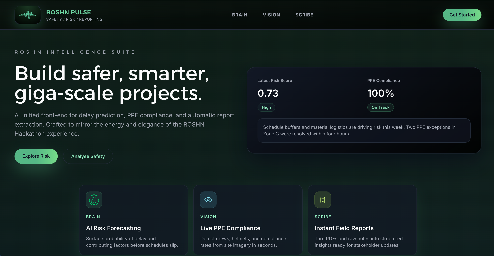

# ROSHN Pulse

ROSHN Pulse is a polished, AI-powered operations cockpit built for giga-scale construction projects. It brings together predictive analytics, computer vision, and automated reporting into a single immersive interface that keeps field teams and decision makers in sync.



---

## ✨ Highlights

- **Brain** – Predict schedule risk with explainable drivers and actionable mitigation insights.
- **Vision** – Analyse site imagery for PPE compliance, overlay detections, and surface breaches instantly.
- **Scribe** – Convert PDFs or raw field notes into structured reports ready for export.
- **Signature Look & Feel** – Mesh gradient backdrop, sticky glass-header, animated feature badges, and responsive cards tuned for large displays.

---

## 🧱 Project Layout

```
.
├── frontend/roshn-pulse-app        # Vite + React 19 front-end
│   ├── src/App.tsx                 # Main Pulse experience
│   ├── src/assets/                 # Brand visuals and icons
│   ├── public/                     # Static assets and favicons
│   └── ...                         # Tailwind, configs, dist output
└── backend (optional)              # Point API_BASE env to your services
```

The UI expects ROSHN services to expose three endpoints by default:

| Capability | Method | Endpoint            | Notes                              |
|------------|--------|---------------------|------------------------------------|
| Brain      | POST   | `/predict-delay`    | Returns risk score + contributors  |
| Vision     | POST   | `/analyze-image`    | Accepts multipart image uploads    |
| Scribe     | POST   | `/extract`          | Accepts file uploads or JSON text  |

Configure the target base URL through `VITE_API_BASE` in `.env`.

---

## 🚀 Getting Started

```bash
cd frontend/roshn-pulse-app
npm install
npm run dev
```

Open the app at [http://localhost:5173](http://localhost:5173). For production builds run:

```bash
npm run build
npm run preview
```

### Environment

Create `.env` inside `frontend/roshn-pulse-app`:

```env
VITE_API_BASE=https://your-backend.example.com
```

When the variable is omitted, the UI falls back to `http://localhost:8000`.

---

## 🧠 Implementation Notes

- **Meshes & Motion** – The hero section introduces animated mesh gradients to set a premium tone while keeping performance in check.
- **Sticky Header** – Navigation remains accessible with transparent glassmorphism and scroll offsets tuned for each section.
- **Section Anchors** – Smooth scrolling with `scroll-mt` offsets ensures content headings remain visible beneath the header.
- **Responsive Cards** – Feature badges and KPI panels scale gracefully from tablets to 4K wall displays.

---

## 🧪 Recommended QA Checklist

1. Verify Brain scoring flow with valid and invalid JSON payloads.
2. Test Vision uploads across small (<2MB) and large imagery, watching compliance UI.
3. Upload both PDF and plain text reports to Scribe and validate extracted fields.
4. Exercise anchor navigation (`Brain`, `Vision`, `Scribe`) across multiple viewport sizes.

---

## 🛠️ Tech Stack

- **Frontend**: React 19, TypeScript, Vite, TailwindCSS
- **Visuals**: Mesh gradients, custom badges, animated overlays
- **Tooling**: ESLint, modern TypeScript configs, npm scripts

---

## 🤝 Contributing

1. Fork the repository
2. Create a feature branch (`git checkout -b feat/awesome-upgrade`)
3. Commit with context (`git commit -m "Add Vision overlay controls"`)
4. Push and open a pull request

---

## 📄 License

This project is distributed under the MIT License. See `LICENSE` for details.

---

Crafted for the ROSHN Hackathon with energy, elegance, and a pulse on the jobsite. 🚀

